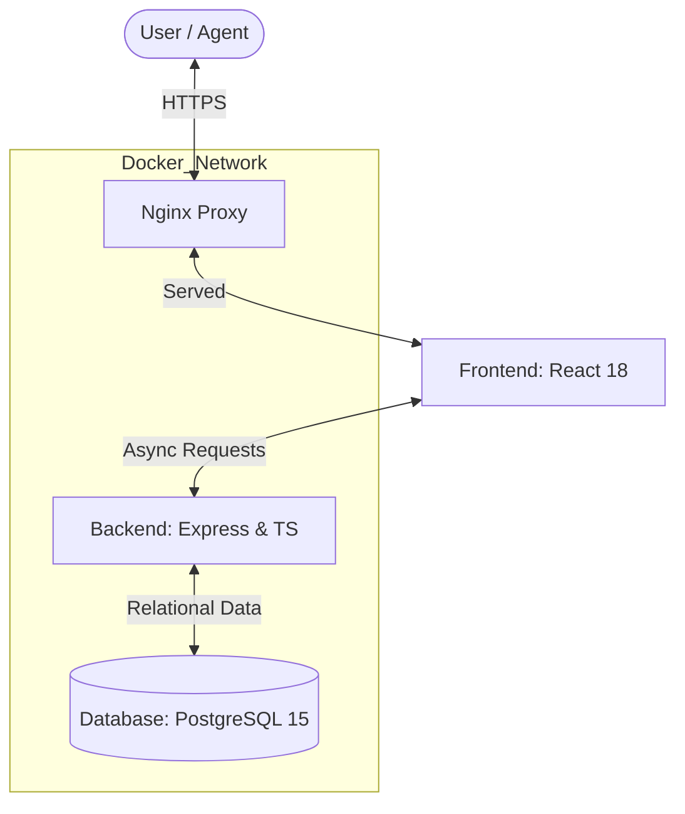

# 🏢 THE PROPERTIST | Executive Real Estate Portfolio Management

[](https://aws.amazon.com/)
[](https://www.docker.com/)
[](https://github.com/features/actions)

**The Propertist** is a premium, full-stack real estate intelligence platform engineered for modern property agents and discerning high-end buyers. Built with a focus on luxury aesthetics and high-performance lead conversion, it streamlines the complex journey from property discovery to successful acquisition.

---

## ✨ Premium Feature Ecosystem

### 🏛️ For Agents (The Executive Suite)
- **High-Performance Lead Hub**: A metric-driven dashboard to track active listings and potential leads in real-time.
- **Conversion Intelligence**: In-depth lead profiles including contact details, specific property interest markers, and automated enquiry tracking.
- **Listing Launchpad**: A professional-grade engine for managing advanced property specifications (Area, BHK, Construction Status, Furnishing, etc.).
- **Smart Notifications**: Real-time alerts for new enquiries and property interactions.

### 🔍 For Buyers (The Discovery Engine)
- **Intelligence-Driven Search**: Advanced filtering by budget (INR), BHK configuration, locality, and construction status with live-fetching capability.
- **Micro-Insight Property Pages**: Transparent specifications including valuation summaries, amenity breakdowns, and verified agent status badges.
- **Secure Callback System**: A friction-less, direct communication protocol with authorized property agents.

---

## 🛠️ Technical Architecture

#### 🏗️ System Overview (Architecture)



### Frontend Layer
- **Core**: React 18 with Type-Safe Architecture (TypeScript)
- **Design System**: Custom-themed **Material UI (MUI v6)** with a high-gloss, premium aesthetic.
- **Build Tool**: Vite for ultra-fast development and optimized production bundles.
- **State & Auth**: React Context API for global session persistence and JWT token management.

### Backend Infrastructure
- **Runtime**: Node.js & Express.js (TS)
- **Database**: PostgreSQL (Relational) for high-integrity data association.
- **Security**: 24h JWT session persistence, Bcrypt password hashing, and CORS-restricted API access.
- **Service Layer**: Decoupled routes (v1) for Auth, Properties, Enquiries, and Notifications.

### 📊 Data Intelligence (PostgreSQL Schema)
The system operates on a relational blueprint ensuring 100% data integrity:
- **`Users`**: Centralized identity management (Agents vs Seekers).
- **`Properties`**: Rich-metadata storage including agent associations and ultra-fine property specs.
- **`Enquiries`**: Bridging seekers/guests with specific properties and agents.
- **`Notifications`**: Asynchronous status tracking for user engagement.

---

## 📦 Containerization & DevOps

The platform is fully containerized using **Docker**, ensuring consistency across development, staging, and production environments.

### Dockerized Services
1.  **PostgreSQL (v15)**: Persistent data storage with volume mapping.
2.  **API Backend**: Node.js environment with automated build stages.
3.  **Client Frontend**: Multistage build using **Nginx** for optimized static asset delivery.

### ☁️ AWS Cloud Infrastructure
The application is deployed on **AWS EC2** using a modern DevOps strategy:
- **Hosting**: Amazon Linux EC2 Instance.
- **Orchestration**: Docker Compose manages the micro-services mesh.
- **Security**: Security Groups configured for port 80 (HTTP), 443 (HTTPS), and 5000 (Protected API).

### 🔄 CI/CD Optimization
Automated deployment is handled via **GitHub Actions**:
- **Continuous Integration**: On every push to `main`, the code is validated.
- **Automated Deployment**: The `deploy.yml` workflow securely connects to the AWS EC2 instance via SSH, pulls the latest changes, and rebuilds the containers using `docker-compose up --build -d`.

---

## 🚀 Getting Started

### 📦 Option A: Docker Setup (Recommended)
Launch the entire stack with a single command:
```bash
docker-compose up --build -d
```
*Access the frontend at `http://54.163.203.92`, API at `http://54.163.203.92:5000`.*

### 🛠️ Option B: Local Development
**1. Prerequisites:**
- Node.js (v18+)
- PostgreSQL Instance running locally

**2. Backend Initialization:**
```bash
cd backend
npm install
npm run dev
```

**3. Frontend Launch:**
```bash
cd frontend
npm install
npm run dev
```

---

## 🔑 Secure Configuration (.env)

### Backend Configuration (`/backend/.env`)
| Variable | Description | Sample Value |
| :--- | :--- | :--- |
| `DB_HOST` | Database host (use `db` for Docker) | `localhost` |
| `DB_USER` | PostgreSQL Username | `postgres` |
| `DB_PASSWORD` | PostgreSQL Password | `1234` |
| `DB_NAME` | Database Name | `property_db` |
| `JWT_SECRET` | Secret key for token signing | `[Required]` |

### Frontend Configuration (`/frontend/.env`)
| Variable | Description | Sample Value |
| :--- | :--- | :--- |
| `VITE_API_BASE_URL` | Endpoint for the API | `http://localhost:5000/api/v1` |
| `VITE_APP_NAME` | Application Brand Name | `The Propertist Platform` |

## 📖 How to Use the Platform

### 🔍 For Property Seekers
1. **Browse & Search**: On the home page, use the search filters to find properties by location, budget, or configuration.
2. **View Details**: Click on any property card to view deep specifications, amenities, and agent details.
3. **Submit Enquiries**: 
   - Interested in a property? Use the enquiry form on the property detail page.
   - You can submit as a **Guest** (no account needed) or as a **Registered User**.

### 🏛️ For Real Estate Agents
1. **Security Access**: Register or Login through the "Login" portal. Ensure your role is set to `Agent` during registration.
2. **Dashboard Management**: Once logged in, visit your **Agent Dashboard** to see:
   - **My Listings**: Manage your active property portfolio.
   - **Lead Center**: Track all incoming enquiries from seekers.
3. **Property Launch**: Use the "Add Property" feature to upload new listings with high-fidelity specifics (BHK, Area, Status, etc.).
4. **Lead Interaction**: Use the contact details provided in the "Lead Center" to follow up with potential buyers directly.

---

## 🔑 Demo Credentials (Live Application)

Use these credentials to test the platform on the [Live Server](http://54.163.203.92):

| Role | Email | Password |
| :--- | :--- | :--- |
| **Agent** | `test@agent.com` | `Agent@1234` |
| **Seeker** | `test@user.com` | `User@1234` |

*Note: You can also register a fresh account using the [Registration Page](http://54.163.203.92/register).*

---

## 🛡️ Engineering Standards & Highlights

*   **End-to-End Type Safety**: Developed with **TypeScript** across both layers to eliminate runtime errors and improve developer velocity.
*   **Security-First Design**:
    *   **Bcrypt**: Native password hashing for secure user storage.
    *   **JWT**: Implementation of stateless authentication for API scalability.
    *   **CORS**: Secure cross-origin resource sharing configuration.
*   **DevOps Excellence**:
    *   **Multi-Stage Docker Builds**: Frontend images are optimized for production using Nginx to serve static assets efficiently.
    *   **Container Orchestration**: Docker Compose ensures identical environments across Development, Testing, and Production.
*   **Scalable API Design**: Decentralized routing architecture (v1) making the system ready for future versioning.

---

## 🔗 API Reference Summary

| Endpoint | Method | Description | Auth Required |
| :--- | :--- | :--- | :--- |
| `/api/v1/auth/register` | `POST` | Create a new user (Agent/Seeker) | No |
| `/api/v1/auth/login` | `POST` | Authenticate and get JWT | No |
| `/api/v1/properties` | `GET` | Fetch all properties with filters | No |
| `/api/v1/properties/1` | `GET` | Get detailed property data | No |
| `/api/v1/properties` | `POST` | Create a new listing | **Agent Only** |
| `/api/v1/enquiries` | `POST` | Submit interest in a property | No (Guest/User) |
| `/api/v1/enquiries/agent` | `GET` | View leads for your properties | **Agent Only** |

---

## 🔮 Project Roadmap (Future Scope)

- [ ] **Google Maps Integration**: Visual property discovery on an interactive map.
- [ ] **AI Property Insights**: Automated description generation using LLMs based on property specs.
- [ ] **Real-time Notifications**: Web-socket based alerts for agents when new leads arrive.
- [ ] **Managed Image Storage**: Migration to AWS S3 for high-resolution property media.

---
*Created for the professional real estate market. Engineered for excellence.*
